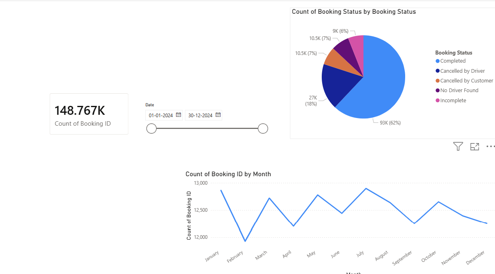
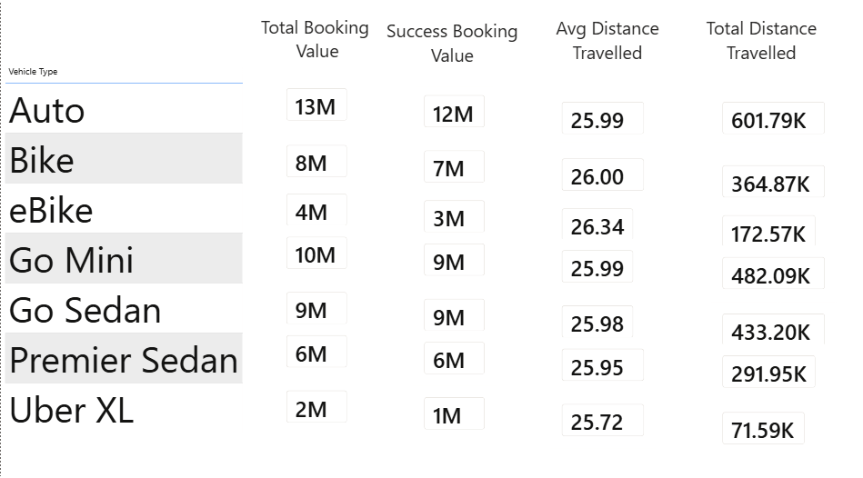
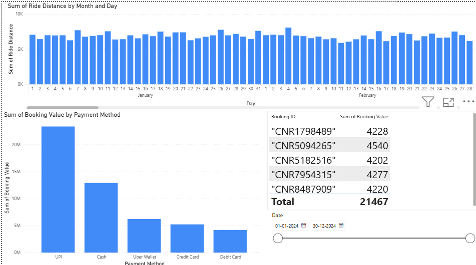
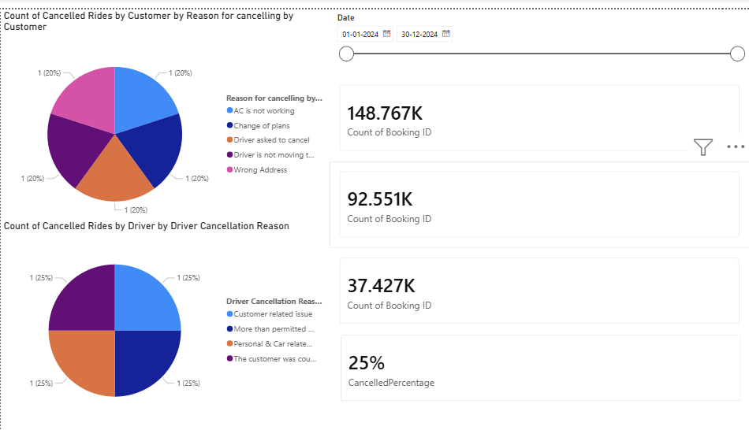
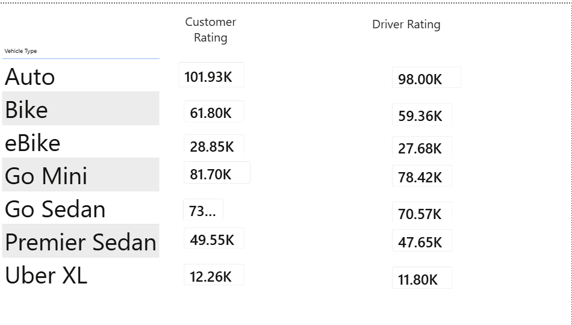
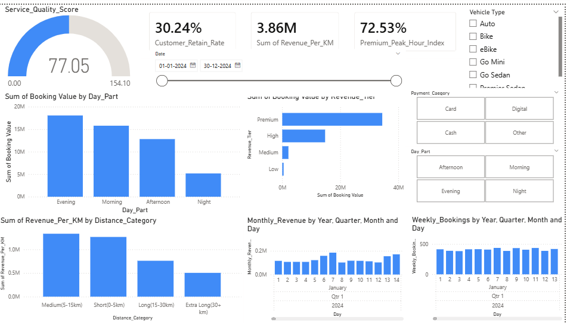

# 🚖 Ride Booking Analytics Dashboard (Power BI)

An end-to-end, multi-page **Power BI** dashboard that analyses **150,000 ride bookings from 2024** to understand booking performance, revenue drivers, cancellations, vehicle-wise performance and customer/driver satisfaction.


---

## 📌 Table of Contents
1. [Project Overview](#-project-overview)
2. [Business Questions](#-business-questions)
3. [Dataset](#-dataset)
4. [Tools & Skills](#-tools--skills)
5. [Data Preparation](#-data-preparation)
6. [Dashboard Pages](#-dashboard-pages)
7. [Key Insights](#-key-insights)
8. [Recommendations](#-recommendations)
9. [Repository Structure](#-repository-structure)
10. [How to Open the Project](#-how-to-open-the-project)

---

## 📖 Project Overview

Ride-hailing platforms generate large volumes of booking data, but raw rows don't help decision makers. This project turns **150K booking records** into an interactive report that answers:

- How many bookings succeed, and why do the rest fail?
- Which vehicle types, time of day and distance ranges bring in the most revenue?
- How do customers pay?
- How do customer and driver ratings compare across vehicle types?

The report is organised into **7 pages** (Homepage, Overall, Vehicle Type, Revenue, Cancellation, Ratings, Summary) with slicers for date range, vehicle type, payment category and day part.

---

## ❓ Business Questions

| # | Question |
|---|----------|
| 1 | What is the overall booking volume and completion rate? |
| 2 | How do bookings trend month by month? |
| 3 | Which vehicle types generate the most booking value and distance? |
| 4 | Which time of day, revenue tier and distance category drive revenue? |
| 5 | Which payment methods are most used? |
| 6 | Why are rides cancelled by customers and by drivers? |
| 7 | How do customer and driver ratings differ by vehicle type? |

---

## 🗂 Dataset

- **Source file:** `rideBookings.csv`
- **Size:** 150,000 rows × 21 columns
- **Period:** 01 Jan 2024 – 30 Dec 2024

| Column group | Fields |
|--------------|--------|
| Booking info | Date, Time, Booking ID, Booking Status, Customer ID, Vehicle Type |
| Location | Pickup Location, Drop Location |
| Turnaround times | Avg VTAT (vehicle), Avg CTAT (customer) |
| Cancellations | Cancelled Rides by Customer / Driver and their reasons |
| Incomplete rides | Incomplete Rides, Incomplete Rides Reason |
| Value & distance | Booking Value, Ride Distance |
| Feedback | Driver Ratings, Customer Rating |
| Payment | Payment Method |

**Booking status split:** Completed 93,000 · Cancelled by Driver 27,000 · No Driver Found 10,500 · Cancelled by Customer 10,500 · Incomplete 9,000

---

## 🛠 Tools & Skills

- **Power BI Desktop** – data modelling, visuals, slicers, multi-page report design
- **Power Query** – data cleaning and transformation
- **DAX** – calculated columns and measures (KPIs such as Customer Retain Rate, Revenue per KM, Premium Peak Hour Index, Cancelled %)
- **Data visualisation** – KPI cards, gauge, bar/column, pie, line charts, matrix tables
- **Data storytelling** – turning metrics into business insights

---

## 🧹 Data Preparation

- Loaded the CSV into Power BI and converted `"null"` text values into proper blanks
- Cleaned the quote-wrapped `Booking ID` / `Customer ID` fields
- Set correct data types for date, time, numeric and text columns
- Created derived fields used in the report:
  - **Day_Part** – Morning / Afternoon / Evening / Night (from booking time)
  - **Distance_Category** – Short (0–5 km), Medium (5–15 km), Long (15–30 km), Extra Long (30+ km)
  - **Revenue_Tier** – Low / Medium / High / Premium (from booking value)
  - **Payment_Category** – Card / Digital / Cash / Other
  - **Weekly_Bookings, Monthly_Revenue, Revenue_Per_KM, CancelledPercentage** and other measures
- Built a date hierarchy (Year → Quarter → Month → Day) for time-based analysis

---

## 📊 Dashboard Pages

### 1️⃣ Overall – Booking Performance
Total bookings (**148.77K** in the filtered view), booking status breakdown and the monthly booking trend.



- About **62%** of bookings are completed; the rest are cancelled by driver, cancelled by customer, no driver found, or incomplete
- Monthly bookings stay in a narrow band of roughly **12K–13K**, peaking in July and dipping in February

---

### 2️⃣ Vehicle Type – Performance by Vehicle
Total vs successful booking value, average distance and total distance for each vehicle type.



- **Auto** leads in booking value (~13M) and total distance (~602K km), followed by **Go Mini** and **Go Sedan**
- **Uber XL** is the smallest segment (~2M booking value)
- Average trip distance is almost identical across vehicle types (~26 km)

---

### 3️⃣ Revenue – Distance & Payment Analysis
Daily ride distance and booking value by payment method, with a booking-level drill-down table.



- **UPI** is the most-used payment method by value, ahead of **Cash**; cards and Uber Wallet are much smaller
- Daily ride distance is steady through the year, which shows stable demand

---

### 4️⃣ Cancellation – Why Rides Fail
Cancellation counts and reasons, split by customer and driver.



- About **25%** of all bookings end in a cancellation
- Customer reasons include AC not working, change of plans, driver asked to cancel, driver not moving and wrong address
- Driver reasons include customer-related issues, personal/car-related issues and more passengers than permitted

---

### 5️⃣ Ratings – Customer vs Driver Satisfaction
Customer and driver rating totals by vehicle type.



- Customer ratings are consistently a little higher than driver ratings in every vehicle category
- **Auto** and **Go Mini** collect the most rating volume, in line with their booking share

---

### 6️⃣ Summary – Executive View
A single-page summary with a **Service Quality Score** gauge, KPI cards (**Customer Retain Rate, Revenue per KM, Premium Peak Hour Index**), and slicers for date, vehicle type, payment category and day part.



- **Evening** and **Morning** are the highest booking-value periods; **Night** is the lowest
- The **Premium** revenue tier contributes by far the largest share of booking value
- **Medium (5–15 km)** and **Short (0–5 km)** trips earn the highest revenue per km

---

## 💡 Key Insights

1. **Only ~62% of bookings complete.** Driver cancellations (18%) are the biggest leak, roughly 2.5× customer cancellations (7%).
2. **Evening and morning peaks** drive most of the booking value, so supply should be planned around commute hours.
3. **Premium-tier bookings** contribute most of the revenue, so a small set of high-value rides carries the business.
4. **Short and medium trips** are the most efficient by revenue per km.
5. **Digital payments (UPI)** dominate over cash, which supports further digital incentives.
6. **Auto, Go Mini and Go Sedan** form the core of the business; Uber XL is a niche segment.
7. **Demand is stable** across 2024, with only small month-to-month movement.

---

## ✅ Recommendations

- Reduce driver-side cancellations with better driver incentives, clearer trip info before acceptance, and penalties for repeat cancellers
- Add more drivers in evening and morning peak slots
- Promote premium and short/medium rides through targeted offers
- Fix the customer-side cancellation causes (vehicle condition such as AC, address accuracy)
- Offer small UPI cashback to push more users away from cash
- Review the Uber XL strategy (pricing, availability, targeted demand)

---

## 📁 Repository Structure

```
ride-analytics-dashboard/
│
├── Ride_Analysis.pbix        # Power BI project file
├── rideBookings.csv          # Raw dataset (150K rows)
├── README.md
└── screenshots/
    ├── 01-overall.png
    ├── 02-vehicle-type.png
    ├── 03-revenue.png
    ├── 04-cancellation.png
    ├── 05-ratings.png
    └── 06-summary.png
```

---

## ▶️ How to Open the Project

1. Install [Power BI Desktop](https://powerbi.microsoft.com/desktop/) (free)
2. Download or clone this repository
3. Open `Ride_Analysis.pbix`
4. If prompted, point the data source to the local `rideBookings.csv`
5. Use the slicers (Date, Vehicle Type, Payment Category, Day Part) to explore

---

## 👤 Author

**Pritesh**
BCA Student, Gujarat Technological University (GTU) | Aspiring Data Analyst

📫 Connect with me: *add your LinkedIn / GitHub / email here*
